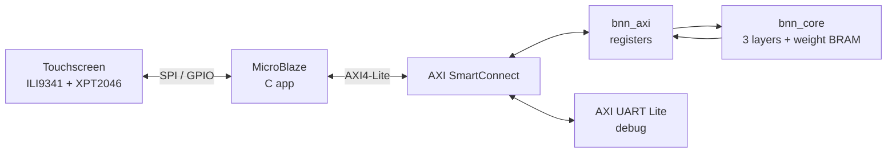

# Binarized Neural Network Accelerator on FPGA

> Draw a digit on a touchscreen; a custom BNN accelerator running on an FPGA classifies it in hardware.


---

## Overview

**Board:** Digilent Arty S7-25 (`xc7s25csga324-1`)
**Display:** 2.8" ILI9341 SPI TFT + XPT2046 touch ([driver](https://github.com/ahnafzareef/ILI9341Driver))

### DEMO VIDEO!!! 
Sorry for the weird resolution, shot on Iphone can you tell? 🤩🤩🤩


https://github.com/user-attachments/assets/385010ce-758f-4b4c-8027-e362d4dbf937


### v1 → v2

This is Version 2 of my BNN hardware accelerator. The ([XNOR-9](https://github.com/ahnafzareef/XNOR-9)) which was the first iteration was
a BNN running on a Tang Nano 9K with an ESP32 Web Server doing the digit streaming over UART.
To me that felt really unfinished and forced. Over the summer I worked on building my FPGA design skills
and made my own ILI9431 SPI Display Driver using Vitis and chose to utilize it for this project such
that I could simply write a digit on the screen and have the predicted number display on the screen.
Not to mention, in this version there was several memory and speed boosts. For one, the weight memory was 
1 bit wide, which means every address held one. single. weight. If you consider that, layer 1 has 784 inputs,
then it is clear that layer 1 requires 200,704 addresses. Not only that, the previous neuron verilog code compared
1 input bit with 1 weight bit PER CLOCK CYCLE. thats 784 clock cycles for layer 1 ALONE. 

Given the increased memory and power of the ARTY S7-25T I chose to optimize this by:
Making weight_mem 64 bits wide since each BRAM is 64 bits wide. This means every address hold
64 weights in ONE row. The address is retrieved by neuron times the number of chunks for that layer plus the
chunk of 64 input bits you are currently on. 

This means that the neuron now compares 64 input bits at every clock cycle. So one neuron now only take
13 clock cycles. Woo hoo! Here's the table comparing the two:

| | v1 | v2 |
|---|---|---|
| Board | Tang Nano 9K | Arty S7-25 |
| Weight memory width | 1 bit | 64 bits |
| Bits per clock | 1 | 64 |
| Clocks per layer-1 neuron | 784 | 13 (+3 overhead) |
| Total clocks per image | ~269,000 | ~6,000 |
| Clock speed | 27 MHz | 100 MHz |
| Time per image | ~10 ms | ~60 µs |
| Front end | ESP32 web server | Touchscreen on MicroBlaze |
| Interface | UART | AXI4-Lite peripheral |

45x less clocks, and about 165x faster overall because of the faster clock aswell. 

---

## System Architecture and my Diagram Drawings

Here's the general System Architecture.


---

## The Network

| Layer | Inputs | Neurons | Output |
|---|---|---|---|
| 1 | 784 | 256 | 256 bits (threshold) |
| 2 | 256 | 256 | 256 bits (threshold) |
| 3 | 256 | 10 | digit (argmax) |

---

I was going to make these into fancy diagrams, but for transparency, here's what I drew out to help me. I hope it helps you see my thought process. All my notes are even added to this repository

## Hardware Design

### Neuron


<!-- XNOR 64 bits -> popcount -> accumulate. clear / en control. -->

### Layer


<!-- Chunk counter, neuron counter, input mux, weight BRAM, delay FFs, threshold compare -->

### Layer FSM


<br><br>


| State | Does |
|---|---|
| IDLE | wait for `start` |
| LOAD | latch input bits |
| CLEAR | reset neuron count |
| RUN | feed one 64-bit chunk per clock |
| WAIT | let the last chunk arrive (1-clk BRAM latency) |
| CHECK | compare / argmax, next neuron or finish |

### Weight Memory Layout

For the RAM I followed the AMD guidelines for single port ROM.

Each layer stores its weights in its own block RAM as **64-bit rows**. One row holds one neuron's weights for 64 consecutive inputs, so a neuron's weights take `CHUNKS` rows back to back:

```
row = neuron × CHUNKS + chunk
```

| Layer | Inputs | CHUNKS | Neurons | Rows |
|---|---|---|---|---|
| 1 | 784 | 13 | 256 | 3,328 |
| 2 | 256 | 4 | 256 | 1,024 |
| 3 | 256 | 4 | 10 | 40 |

784 doesn't divide evenly by 64, so layer 1's last chunk holds 16 real inputs plus 48 padding bits. The input padding is `0` and the weight padding is `1`, so `XNOR(0, 1) = 0` and padding never counts as a match.

The BRAM read takes 1 clock, so the input chunk and the `en` signal pass through a 1-clock delay register to arrive at the neuron at the same time as the weights.

### One Module, Three Layers

All three layers are the same `layer.sv` module, configured per instance with parameters:

| Parameter | Layer 1 | Layer 2 | Layer 3 |
|---|---|---|---|
| `INPUTS_I` | 784 | 256 | 256 |
| `WIDTH_O` | 256 | 256 | 10 |
| `ARGMAX` | 0 | 0 | 1 |

Every width (counters, address, count, input register) is derived from these parameters, so each instance is sized exactly for its layer. `ARGMAX` switches the decision step: layers 1–2 compare each neuron's count to its threshold and output a bit, while layer 3 keeps the highest count and outputs the winning neuron's index as the digit.

Because `ARGMAX` is a constant, Vivado only builds the branch each instance uses: the argmax registers are removed from layers 1–2, and the threshold memory is removed from layer 3.

---


## Brief Implementation Details

Briefly going over how I implemented the main parts of the accelerator:

- **Neuron:** XNORs a 64-bit input chunk with a 64-bit weight chunk, then popcounts the result (just used `$countones`, Vivado turns it into an adder tree) and adds it to a running 10-bit count. `clear` & `en` decide if it resets, adds or holds. Kept it as its own module so all 3 layers use the exact same neuron.
- **Layer:** FSM that goes IDLE → LOAD → CLEAR → RUN → WAIT → CHECK, with a chunk counter & neuron counter driving everything. The annoying part was the timing (This took me a while to actually understand), the BRAM takes a clock to give you the weights so the input chunk and `en` both had to go through a delay FF to line up with it, and I needed the WAIT state so the last chunk actually gets counted before CHECK reads it. Had to draw out the whole thing clock by clock before it clicked.
- **Weight ROM:** Followed AMD's UG901 (ROM HDL Coding Techniques, the `rams_sp_rom` example) to get Vivado to actually put the weights in BRAM instead of LUTs. Clocked read, `rom_style = "block"`, and `$readmemb` so the weights get baked right into the bitstream. Each row is 64 bits (`row = neuron × CHUNKS + chunk`) and since 784 doesn't divide by 64, the last chunk gets padded with 1s on the weight side so it never counts as a match.
- **One module, 3 layers:** `layer.sv` is parameterized (`INPUTS_I`, `WIDTH_O`, `ARGMAX`) and every width comes off those, so each layer is sized for itself. Layer 3 just flips `ARGMAX` on to keep the highest count instead of thresholding. Vivado prunes whatever branch isn't used so it doesn't cost anything.
- **AXI4-Lite:** First time doing AXI. Used Vivado's AXI4 peripheral template for the handshake stuff and swapped out its registers for my own (CTRL, STATUS, RESULT + 25 image words). Writing to CTRL makes a 1-clock start pulse, and done gets latched into a sticky bit since the CPU is way too slow to catch a 1-clock pulse. Had a really annoying bug where the packaged IP kept its address width at 4 bits even after I changed it to 7 in the HDL, ended up having to go into `component.xml` and change it by hand.
- **Reset/start:** Button reset is double flopped so it doesn't go metastable, and there's a one-shot start pulse after power-up for testing the accelerator on its own.
- **Software (used AI for this):** The weight export script and the MicroBlaze touch app were written with AI since this is mainly an RTL project. The app uses my [ILI9341 driver](https://github.com/ahnafzareef/ILI9341Driver), centers whatever you draw, packs it into 25 words and sends it to the accelerator over AXI. Honestly the touch is still a bit jank and I think it could be a lot better.
---

## AXI4-Lite Interface

| Offset | Name | Access | Description |
|---|---|---|---|
| `0x00` | CTRL | W | bit 0 = start |
| `0x04` | STATUS | R | bit 0 = done (sticky, cleared on start) |
| `0x08` | RESULT | R | bits [3:0] = digit |
| `0x10`-`0x70` | IMAGE0-24 | R/W | 784-bit image, 32 pixels per word |

<!-- start pulse + sticky done explanation -->

---

## Results

### Resource Utilization

| Resource | Used | Available | % |
|---|---|---|---|
| Slice LUTs | 3,731 | 14,600 | 26% |
| Slice Registers | 4,815 | 29,200 | 16% |
| LUT as Memory | 150 | 5,000 | 3% |
| Block RAM Tiles | 28 | 45 | 62% |
| Bonded IOB | 12 | 150 | 8% |
| MMCM | 1 | 3 | 33% |


<!-- your utilization paragraph -->

### Timing

| Metric | Value |
|---|---|
| Clock | 100 MHz |
| WNS | +0.251 ns |
| WHS | +0.009 ns |
| Failing endpoints | 0 |
<!-- your timing paragraph -->

---

## Build & Run
For me the neural network remained the same, as such ([XNOR-9](https://github.com/ahnafzareef/XNOR-9)) has all the weights.npy files for each layer which was used here. The main difference is the exportation of the width need to match a new structure because I changed how they're saved in BRAM. 
So once you get those weights just: 

1. **Export weights:** `python python/export_weights.py`
2. **Vivado:** package `BNN_AXI_IP`, add to block design, generate bitstream, export `.xsa`
3. **Vitis:** create platform from `.xsa`, build and run the app in `TouchScreenDriver/bnn_touch`

---

## Verification

Learning DV from scratch, once i figure out what to actually put here I will.


## Ideation and Though Process (Messy)
Neural networks are big, when you want something to do with them it often requires you to have a device with maximal footprint/storage for you to get meaningful usage out of it. But as time goes on a need for smaller systems running hardware like this becomes much more meaningful and required. While this device might seemingly be minute in the grand scheme of things, I guess it is my first look into the World I look to explore about how to shrink models down and make them more sustainable. Anyone reading this knows the effect of the huge data centers, and I want to explore a realm where we can get the same level of efficiency and accuracy with much less of a footprint.

The idea started from the research paper cited in the original ([XNOR-9](https://github.com/ahnafzareef/XNOR-9)) project. The idea is simple, modern neural networks have complex math. A standard neural network takes an input as a floating point number, computes its weight as a floating point number, multiplies the two together and adds all of these results together for each neuron in a layer and determines if this input is meaningful. If that meant nothing to you, it might help to imagine that this operation alone requires a **multiplier and an accumulator** in the scheme of digital logic. However, if there was a way to represent all that I have mentioned as binary numbers, then the operations become simple. Multiplying a 1 or 0 is simply just an XNOR, they either agree or disagree, and adding them together is as simple as a 1 bit adder. So we've gone from a huge adder tree plus the logic for a multiplier to just one gate, the XNOR. 

So then I began thinking: "how could I implement this?". I wanted to do digit recognition, I wanted to write something on a screen and have it predict what digit I wrote. Well I've worked extensively with MNIST and MobileNet and all those datasets before. MNIST has a preconfigured dataset of 28by28 images, flattened to 784 pixels. So I thought, we can train a model on TensorFlow like I've done a million times, take those weights, somehow put them onto the FPGA (who knows where at this stage) and I should be able to take incoming images, flatten them to a row of bits, compare each bit to its respective input bit and voila! 

The idea was simple, a 256-256-10 layer neural network, Layer 1 taking 784 inputs (28x28 MNIST Image), layer 2 taking the output of layer 1(256) and layer 3 taking the output of layer 2 (256) and adding a count to its 10 neurons which one has more matches, whichever has the most matches is the most likely digit (0-9), I learned that this was called argmax. 

So, how do you get these weights to be stored, biggest issue right? Well there exists BRAN (thank you NANDLAND for your amazing videos), BRAM has many different configurations like single port, dual port or simply just ROM. I needed ROM, I never wanted to touch these weights after placing them there. 
And so if you go through the user ([user guides](https://docs.amd.com/r/en-US/ug901-vivado-synthesis/HDL-Coding-Techniques)), go to the the RAM HDL Coding guidelines and find the single port ROM section it shows you how to instantiate a module for BRAM inference by the compiler. This just means the compiler sees you want something that needs huge storage, and it assumes the better way of storing this is not individual LUTs but in the BRAM. Each BRAM block is 45 blocks, each block is 36 Kb each, which is about 1620 Kb. Please notice the lowercase b, its kilobits, even I was confused. Each block is 32 Kb of data with 4 Kb of parity bits. They are all clocked as per the user guides, and are normally used for large CDC. One row in a block can be 36 bits wide. In my design I wanted 64 bits in one BRAM slot cause speed. So what Vivado does is it puts two blocks next to eachother and reads from the same address. And now you may be asking why it doesn't use another row in the same block, well that's cause one port reads one row per clock. In the same block, reading multiple rows is impossible. Ok anyways, so I wanted one row to be 64 input bits for one neuron starting from neuron 0. So that means neuron 0 which takes 784 input bits has 13 chunks of these 64 bit rows times 256 neurons. Layer 2 has only 10 chunks and layer 3 only has 4. The way I thought about computing each address is simple. Take the total number of chunks in that row (say 12) then multiply it by the the neuron you're on (say 1) then add which input chunk you're currently on (lets say we're on the first one) so its 13 times 1 plus 0, which is 13. See the table below. 

Example (layer 1, `CHUNKS = 13`):

| Row | Neuron | Chunk | Inputs covered |
|---|---|---|---|
| 0 | 0 | 0 | 0 – 63 |
| 1 | 0 | 1 | 64 – 127 |
| ... | ... | ... | ... |
| 12 | 0 | 12 | 768 – 783 (+ 48 padding) |
| 13 | 1 | 0 | 0 – 63 |
| 14 | 1 | 1 | 64 – 127 |
| ... | ... | ... | ... |
| 3,327 | 255 | 12 | 768 – 783 (+ 48 padding) |

So neuron 1, chunk 0 is row `1 × 13 + 0 = 13`, right after neuron 0's last row.

Ok anyways now that I got that set. I made the RTL for a neuron, then the layers then the top module. The neuron was simple, as shown in the neuron block diagram above, you take 64 incoming input bits, XNOR with 64 incoming weight bits, add them together with an adder tree. Then we add them to the total count. We then have a MUX, this MUX is so if we choose to clear or enable then it either sets to 0 or allows the new value to get stored on the FF.

Ok from there I went to make layer RTL. It was also quite simple, its just an FSM with states IDLE, LOAD, CLEAR, RUN, WAIT and CHECK. So in other words we loaded all the inputs into one register for one layer so 784 for layer 1, PULL 64 bit of that input, pull 64 bits of that output, push them into our neuron we just made and watch the magic happen. The additional stuff is the RTL for comparing it to the treshold, so it's just a comparator and then when it's done it goes to the done state for that layer. This is all much easier visualized by looking at the layer FSM and BD all the way above. **I wanted to include this point that because BRAM is clocked, both the enable and the INPUT REG are flopped, which means they are held for a clock cycle because BRAM is clocked and everything happens on one clock edge so I had to line them up. TRUST ME, YOU NEED THIS, it is too much work to ignore this. Trying to figure out why this is the case genuinely took me forever, it wasn't until I read the documentation, still didn't understand it and then got the suggestion from AI that BRAM is clocked, your inputs and enable signal are not, that I figured it out** 

The rest was easy, Vivado makes it super easy to make an IP with their IP manager, so I made it into an IP. Took the IP from my neuron and layer stuff and added it to my block diagram for the Microblaze system for the ILI9341 driver, ran connection automation, generated the XSA, put it onto Vitis, programmed a new C program that connects the displays SPI output to the IP and then takes the output from IP which is the digit and then displays it on the screen. 

This entire project has so many little parts to it, it's a bunch of micro projects combined into one.


## AI Usage

AI was used in developing this, but not all of it. 

The entirety of the touch ([driver](https://github.com/ahnafzareef/ILI9341Driver)) I made this summer was done by me by referencing a design for an existing driver. In addition to that the RTL written in this program is all mine and worked through by me.
AI is not good at interpreting the drawings and ideas you have on your notes. Maybe not yet. Instead I did use it and told it about what I had drawn and my plans, and it gave me advice, how to optimize and if it's even possible.

AI was used to:
- Determine whether something was possible
- Write the Python Scripts for exporting the weights. To be clear, since this was a Verilog Project I used AI to write all of `python/export_hw.py` and `python/mem_to_c.py`. I was however in charge of dealing with structuring the memory to fit the specification that I wrote down in my notes
  for the BRAM otherwise obviously it wouldn't work.
- Help me write `TouchScreenDriver/bnn_touch/src/main.c` by taking my driver and showing me how to wire it up. 
- Learning about how AXI even works and also how BRAM works, also did AI reading through UG1037, UG109 and UG473 for User Guides on determining how to make a BRAM module, AXI4 IP and more.
- I also used it to take my (very loosely written) readme and turn it into some of the stuff you see in this readme!
---

## Future Work
- Ok so still not computing many neurons at once, I want to make it MUCH MUCH faster by computing multiple neurons per layer.
- Scale/Center preprocessing for better accuracy.
