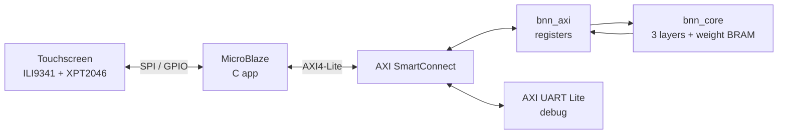

# XNOR-9: Binarized Neural Network Accelerator on FPGA

> Draw a digit on a touchscreen; a custom BNN accelerator running on an FPGA classifies it in hardware.


---

## Overview

**Board:** Digilent Arty S7-25 (`xc7s25csga324-1`)
**Display:** 2.8" ILI9341 SPI TFT + XPT2046 touch ([driver](https://github.com/ahnafzareef/ILI9341Driver))

### v1 → v2

This is Version 2 of my BNN hardware accelerator. The ([XNOR-9](https://github.com/ahnafzareef/XNOR-9)) which was the first iteration was
a BNN running on a Tang Nano 9K with an ESP32 Web Server doing the digit streaming over UART.
To me that felt really unfinished and forced. Over the summer I worked on building my FPGA design skills
and made my own ILI9431 SPI Display Driver using Vitis and chose to utilize it for this project such
that I could simply write a digit on the screen and have the predicted number display on the screen.
Not to mention, in this version there was several memory and speed boosts. For one, the weight memory was 
1 bit wide, which means every address held one. single. weight. If you consider that, layer 1 has 784 inputs,
then it is clear that layer 1 requires 200,704 addresses. Not only that, the previous neuron verilog code compared
1 input bit with 1 weight bit PER CLOCK CYCLE. thats 784 clock cycles for layer 1 ALONE. 

Given the increased memory and power of the ARTY S7-25T I chose to optimize this by:
Making weight_mem 64 bits wide since each BRAM is 64 bits wide. This means every address hold
64 weights in ONE row. The address is retrieved by neuron times the number of chunks for that layer plus the
chunk of 64 input bits you are currently on. 

This means that the neuron now compares 64 input bits at every clock cycle. So one neuron now only take
13 clock cycles. Woo hoo! Here's the table comparing the two:

| | v1 | v2 |
|---|---|---|
| Board | Tang Nano 9K | Arty S7-25 |
| Weight memory width | 1 bit | 64 bits |
| Bits per clock | 1 | 64 |
| Clocks per layer-1 neuron | 784 | 13 (+3 overhead) |
| Total clocks per image | ~269,000 | ~6,000 |
| Clock speed | 27 MHz | 100 MHz |
| Time per image | ~10 ms | ~60 µs |
| Front end | ESP32 web server | Touchscreen on MicroBlaze |
| Interface | UART | AXI4-Lite peripheral |

45x less clocks, and about 165x faster overall because of the faster clock aswell. 

---

## System Architecture and my Diagram Drawings

Here's the general System Architecture.


---

## The Network

| Layer | Inputs | Neurons | Output |
|---|---|---|---|
| 1 | 784 | 256 | 256 bits (threshold) |
| 2 | 256 | 256 | 256 bits (threshold) |
| 3 | 256 | 10 | digit (argmax) |

---

I was going to make these into fancy diagrams, but for transparency, here's what I drew out to help me. I hope it helps you see my thought process. All my notes are even added to this repository

## Hardware Design

### Neuron

[neuron](
)

<!-- XNOR 64 bits -> popcount -> accumulate. clear / en control. -->

### Layer

[layer](
)

<!-- Chunk counter, neuron counter, input mux, weight BRAM, delay FFs, threshold compare -->

### Layer FSM

[fsm](
)

| State | Does |
|---|---|
| IDLE | wait for `start` |
| LOAD | latch input bits |
| CLEAR | reset neuron count |
| RUN | feed one 64-bit chunk per clock |
| WAIT | let the last chunk arrive (1-clk BRAM latency) |
| CHECK | compare / argmax, next neuron or finish |

### Weight Memory Layout

<!-- row = neuron * CHUNKS + chunk ; 64-bit rows ; padding bits = 1 -->

### One Module, Three Layers

<!-- INPUTS_I, WIDTH_O, ARGMAX parameters; Vivado prunes unused logic per instance -->

---

## AXI4-Lite Interface

| Offset | Name | Access | Description |
|---|---|---|---|
| `0x00` | CTRL | W | bit 0 = start |
| `0x04` | STATUS | R | bit 0 = done (sticky, cleared on start) |
| `0x08` | RESULT | R | bits [3:0] = digit |
| `0x10`-`0x70` | IMAGE0-24 | R/W | 784-bit image, 32 pixels per word |

<!-- start pulse + sticky done explanation -->

---

## Results

### Resource Utilization

| Resource | Used | Available | % |
|---|---|---|---|
| Slice LUTs | | 14,600 | |
| Slice Registers | | 29,200 | |
| Block RAM Tiles | | 45 | |

<!-- your utilization paragraph -->

### Timing

| Metric | Value |
|---|---|
| Clock | 100 MHz |
| WNS | |
| WHS | |

<!-- your timing paragraph -->

### Latency

<!-- ~60 us per inference -->

---

## Repository Structure

```
.
├── rtl/          # neuron, layer, weight_mem, bnn_core, bnn_top
├── ip_repo/      # packaged bnn_axi AXI4-Lite IP
├── sw/           # MicroBlaze touch app (C)
├── python/       # weight export
├── weights/      # trained .npy + generated .mem files
└── docs/         # diagrams, demo
```

---

## Build & Run
For me the neural network remained the same, as such ([XNOR-9](https://github.com/ahnafzareef/XNOR-9)) has all the weights.npy files for each layer which was used here. The main difference is the exportation of the width need to match a new structure because I changed how they're saved in BRAM. 
So once you get those weights just: 

1. **Export weights:** `python python/export_weights.py`
2. **Vivado:** package `BNN_AXI_IP`, add to block design, generate bitstream, export `.xsa`
3. **Vitis:** create platform from `.xsa`, build and run the app in `TouchScreenDriver/bnn_touch`

---

## Verification

<!-- Hardware validated on board (MNIST samples + live drawing). -->
<!-- UVM verification in progress: golden model, scoreboard, assertions, coverage. -->

---

## AI Usage

<!-- Weight export script and MicroBlaze touch app written with AI assistance.
     RTL design (neuron, layer, FSM, bnn_core) is my own. -->

---

## Future Work

- [ ] Multiple neurons in parallel per layer
- [ ] Complete UVM verification
- [ ] Scale/center preprocessing for better accuracy on hand-drawn digits
