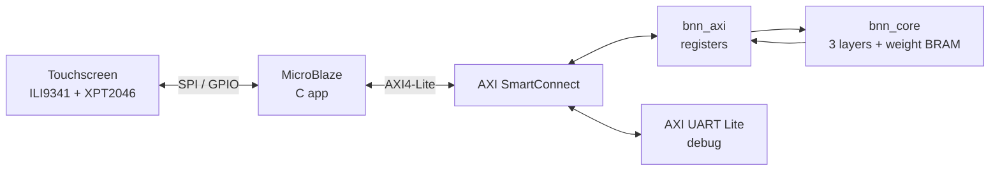

# Binarized Neural Network Accelerator on FPGA

> Draw a digit on a touchscreen; a custom BNN accelerator running on an FPGA classifies it in hardware.


---

## Overview

**Board:** Digilent Arty S7-25 (`xc7s25csga324-1`)
**Display:** 2.8" ILI9341 SPI TFT + XPT2046 touch ([driver](https://github.com/ahnafzareef/ILI9341Driver))

### DEMO VIDEO!!! 
Sorry for the weird resolution, shot on Iphone can you tell? 🤩🤩🤩


https://github.com/user-attachments/assets/385010ce-758f-4b4c-8027-e362d4dbf937


### v1 → v2

This is Version 2 of my BNN hardware accelerator. The ([XNOR-9](https://github.com/ahnafzareef/XNOR-9)) which was the first iteration was
a BNN running on a Tang Nano 9K with an ESP32 Web Server doing the digit streaming over UART.
To me that felt really unfinished and forced. Over the summer I worked on building my FPGA design skills
and made my own ILI9431 SPI Display Driver using Vitis and chose to utilize it for this project such
that I could simply write a digit on the screen and have the predicted number display on the screen.
Not to mention, in this version there was several memory and speed boosts. For one, the weight memory was 
1 bit wide, which means every address held one. single. weight. If you consider that, layer 1 has 784 inputs,
then it is clear that layer 1 requires 200,704 addresses. Not only that, the previous neuron verilog code compared
1 input bit with 1 weight bit PER CLOCK CYCLE. thats 784 clock cycles for layer 1 ALONE. 

Given the increased memory and power of the ARTY S7-25T I chose to optimize this by:
Making weight_mem 64 bits wide since each BRAM is 64 bits wide. This means every address hold
64 weights in ONE row. The address is retrieved by neuron times the number of chunks for that layer plus the
chunk of 64 input bits you are currently on. 

This means that the neuron now compares 64 input bits at every clock cycle. So one neuron now only take
13 clock cycles. Woo hoo! Here's the table comparing the two:

| | v1 | v2 |
|---|---|---|
| Board | Tang Nano 9K | Arty S7-25 |
| Weight memory width | 1 bit | 64 bits |
| Bits per clock | 1 | 64 |
| Clocks per layer-1 neuron | 784 | 13 (+3 overhead) |
| Total clocks per image | ~269,000 | ~6,000 |
| Clock speed | 27 MHz | 100 MHz |
| Time per image | ~10 ms | ~60 µs |
| Front end | ESP32 web server | Touchscreen on MicroBlaze |
| Interface | UART | AXI4-Lite peripheral |

45x less clocks, and about 165x faster overall because of the faster clock aswell. 

---

## System Architecture and my Diagram Drawings

Here's the general System Architecture.


---

## The Network

| Layer | Inputs | Neurons | Output |
|---|---|---|---|
| 1 | 784 | 256 | 256 bits (threshold) |
| 2 | 256 | 256 | 256 bits (threshold) |
| 3 | 256 | 10 | digit (argmax) |

---

I was going to make these into fancy diagrams, but for transparency, here's what I drew out to help me. I hope it helps you see my thought process. All my notes are even added to this repository

## Hardware Design

### Neuron


<!-- XNOR 64 bits -> popcount -> accumulate. clear / en control. -->

### Layer


<!-- Chunk counter, neuron counter, input mux, weight BRAM, delay FFs, threshold compare -->

### Layer FSM


<br><br>


| State | Does |
|---|---|
| IDLE | wait for `start` |
| LOAD | latch input bits |
| CLEAR | reset neuron count |
| RUN | feed one 64-bit chunk per clock |
| WAIT | let the last chunk arrive (1-clk BRAM latency) |
| CHECK | compare / argmax, next neuron or finish |

### Weight Memory Layout

For the RAM I followed the AMD guidelines for single port ROM.

Each layer stores its weights in its own block RAM as **64-bit rows**. One row holds one neuron's weights for 64 consecutive inputs, so a neuron's weights take `CHUNKS` rows back to back:

```
row = neuron × CHUNKS + chunk
```

| Layer | Inputs | CHUNKS | Neurons | Rows |
|---|---|---|---|---|
| 1 | 784 | 13 | 256 | 3,328 |
| 2 | 256 | 4 | 256 | 1,024 |
| 3 | 256 | 4 | 10 | 40 |

784 doesn't divide evenly by 64, so layer 1's last chunk holds 16 real inputs plus 48 padding bits. The input padding is `0` and the weight padding is `1`, so `XNOR(0, 1) = 0` and padding never counts as a match.

The BRAM read takes 1 clock, so the input chunk and the `en` signal pass through a 1-clock delay register to arrive at the neuron at the same time as the weights.

### One Module, Three Layers

All three layers are the same `layer.sv` module, configured per instance with parameters:

| Parameter | Layer 1 | Layer 2 | Layer 3 |
|---|---|---|---|
| `INPUTS_I` | 784 | 256 | 256 |
| `WIDTH_O` | 256 | 256 | 10 |
| `ARGMAX` | 0 | 0 | 1 |

Every width (counters, address, count, input register) is derived from these parameters, so each instance is sized exactly for its layer. `ARGMAX` switches the decision step: layers 1–2 compare each neuron's count to its threshold and output a bit, while layer 3 keeps the highest count and outputs the winning neuron's index as the digit.

Because `ARGMAX` is a constant, Vivado only builds the branch each instance uses: the argmax registers are removed from layers 1–2, and the threshold memory is removed from layer 3.

---

## AXI4-Lite Interface

| Offset | Name | Access | Description |
|---|---|---|---|
| `0x00` | CTRL | W | bit 0 = start |
| `0x04` | STATUS | R | bit 0 = done (sticky, cleared on start) |
| `0x08` | RESULT | R | bits [3:0] = digit |
| `0x10`-`0x70` | IMAGE0-24 | R/W | 784-bit image, 32 pixels per word |

<!-- start pulse + sticky done explanation -->

---

## Results

### Resource Utilization

| Resource | Used | Available | % |
|---|---|---|---|
| Slice LUTs | 3,731 | 14,600 | 26% |
| Slice Registers | 4,815 | 29,200 | 16% |
| LUT as Memory | 150 | 5,000 | 3% |
| Block RAM Tiles | 28 | 45 | 62% |
| Bonded IOB | 12 | 150 | 8% |
| MMCM | 1 | 3 | 33% |


<!-- your utilization paragraph -->

### Timing

| Metric | Value |
|---|---|
| Clock | 100 MHz |
| WNS | +0.251 ns |
| WHS | +0.009 ns |
| Failing endpoints | 0 |
<!-- your timing paragraph -->

---

## Build & Run
For me the neural network remained the same, as such ([XNOR-9](https://github.com/ahnafzareef/XNOR-9)) has all the weights.npy files for each layer which was used here. The main difference is the exportation of the width need to match a new structure because I changed how they're saved in BRAM. 
So once you get those weights just: 

1. **Export weights:** `python python/export_weights.py`
2. **Vivado:** package `BNN_AXI_IP`, add to block design, generate bitstream, export `.xsa`
3. **Vitis:** create platform from `.xsa`, build and run the app in `TouchScreenDriver/bnn_touch`

---

## Verification

<!-- Hardware validated on board (MNIST samples + live drawing). -->
<!-- UVM verification in progress: golden model, scoreboard, assertions, coverage. -->

## AI Usage

AI was used in developing this, but not all of it. 

The entirety of the touch ([driver](https://github.com/ahnafzareef/ILI9341Driver)) I made this summer was done by me by referencing a design for an existing driver. In addition to that the RTL written in this program is all mine and worked through by me.
AI is not good at interpreting the drawings and ideas you have on your notes. Maybe not yet. Instead I did use it and told it about what I had drawn and my plans, and it gave me advice, how to optimize and if it's even possible.

AI was used to:
- Determine whether something was possible
- Write the Python Scripts for exporting the weights. To be clear, since this was a Verilog Project I used AI to write all of `python/export_hw.py` and `python/mem_to_c.py`. I was however in charge of dealing with structuring the memory to fit the specification that I wrote down in my notes
  for the BRAM otherwise obviously it wouldn't work.
- Help me write `TouchScreenDriver/bnn_touch/src/main.c` by taking my driver and showing me how to wire it up. 
- Learning about how AXI even works and also how BRAM works, also did AI reading through UG1037, UG109 and UG473 for User Guides on determining how to make a BRAM module, AXI4 IP and more.
- I also used it to take my (very loosely written) readme and turn it into some of the stuff you see in this readme!
---

## Future Work
- Ok so still not computing many neurons at once, I want to make it MUCH MUCH faster by computing multiple neurons per layer.
- Scale/Center preprocessing for better accuracy.
